<h1> Phishing Detection Experiment (power analysis) </h1>

	The present repository contains results from simulations of accuracy responses intended for power analysis via a precision method. A Bayesian workflow approach is presented, where three models are presented. Each model improves inference and predictions respect to the previous one. Simulations are intended to represent responses to an oddball experiment, where two groups of participants will be presented with threatening (25) and safe (75) stimuli, threatening stimuli being the oddball/target (25% of stimuli). Both groups will be instructed to answer to threatening stimuli only, but the first group will receive a cue (i.e. a specific detail that "gives away" threatening stimuli), and the second group will receive no hint/cue. Thus, we simulate group 1 with only 5% miss rate, and 15% false alarm (FA) rate; and we simulate group 2 with 15% miss rate and 30-50% FA rate.

<h1> Model 1 </h1>

 The model used for power analysis corresponds to a signal detection theory (SDT) model using "fixed" parameters. 

 dg,p ~ Normal(0, 1) 

 dg,p ~ Normal(0, 1) 

 cg,p ~ Normal(0, 1) 

 erf(z) = (2&div;&Sqrt;&pi;)&int;0zexp(-t2) dt, t = 0...z 

 cdf(x) = 0.5(1 + erf(x/&Sqrt;2)) 

 hg,p = cdf(d/2 - c) 

 fg,p = cdf(-d/2 - c) 

 yh ~ Binomial(hg,p , s) 

 yf ~ Binomial(fg,p , n) 

 Where, g = groups (1...G, G=2), p = participants (1...P, P equals number of simulated participants per run),  s = misses + hits, and n = correct rejections (CR) + false alarms (FA); erf corresponds to the error function, and cdf corresponds to the cumulative density function of a standard Gaussian. Observations for yh are total hits and observations for yf are total FAs. Observations are simulated responses from participant, 1 participant added per run up to 100 runs. Simulations are from two groups, one high accuracy (HA) and one low accuracy (LA). HA misses are rounded random draws from a Binomial(25, 0.05) and HA hits are 25 - misses; HA FAs are rounded random draws from a Binomial(75, 0.15) and HA hits are 75 - FAs. LA misses are rounded random draws from a Binomial(25, 0.15) and LA hits are 25 - misses; LA FAs are rounded random draws from a Binomial(75, 0.5) and LA hits are 75 - FAs. Where maximum Hits are 25 and maximum CRs are 75, from 100 total stimuli within an oddball task.

 We sampled the model using Markov chain Monte Carlo (MCMC) No U-turn sampling (NUTS) with 1000 tuning steps, 1000 samples, 4 chains. Models sampled without divergences and good effective samples, but for even better performance we re-run the final run (100 participants) with 2000 tuning steps and 2000 samples (see power/summary.csv). 

<h1> Results </h1>

 Results from the HA group show that precision decreases exponentially when participants increase for both sensitivity (d') and bias (c), achieving good certainty after 40 participants. 

	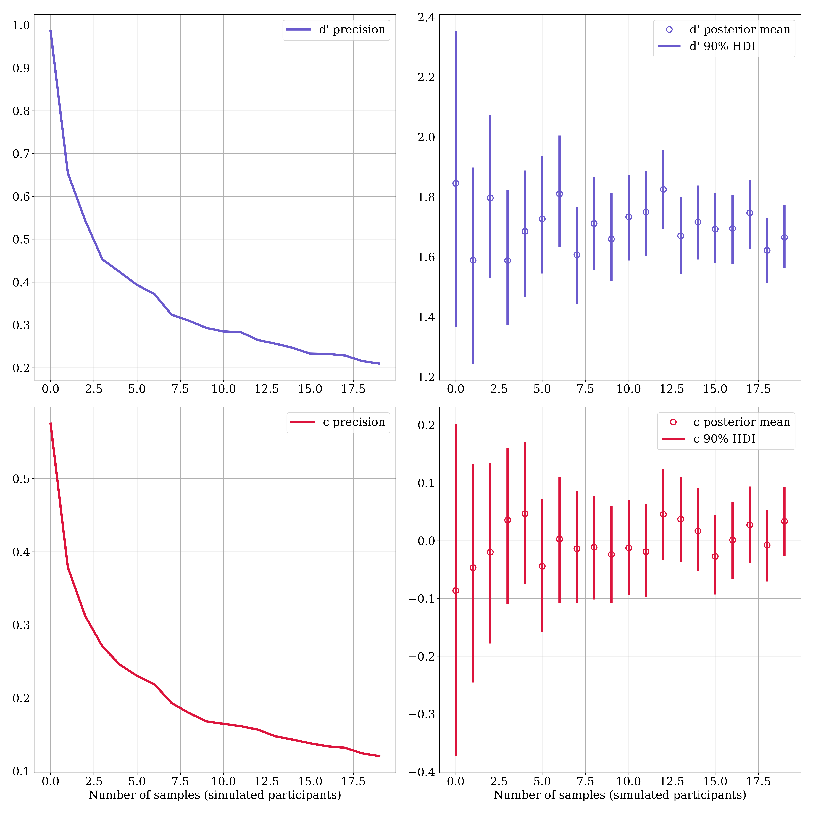

 Results from the LA group show that precision decreases exponentially when participants increase for both sensitivity (d') and bias (c), achieving good certainty after 20 participants. 

	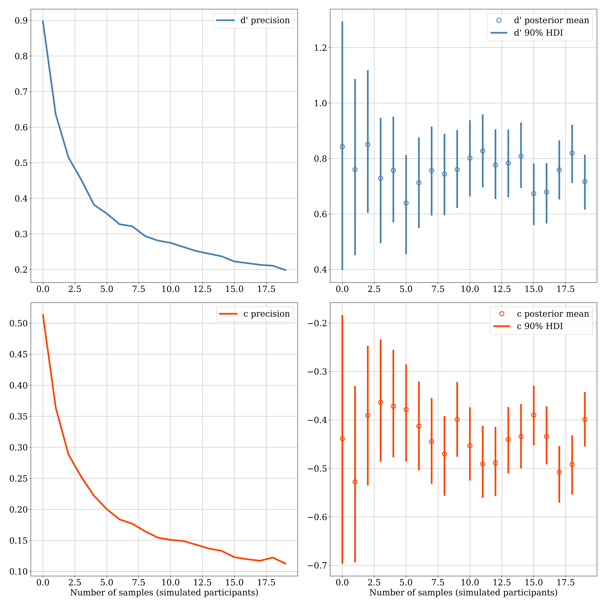

 Predictions from the posterior for the HA group are not good, however; in particular for predicted hits. 

	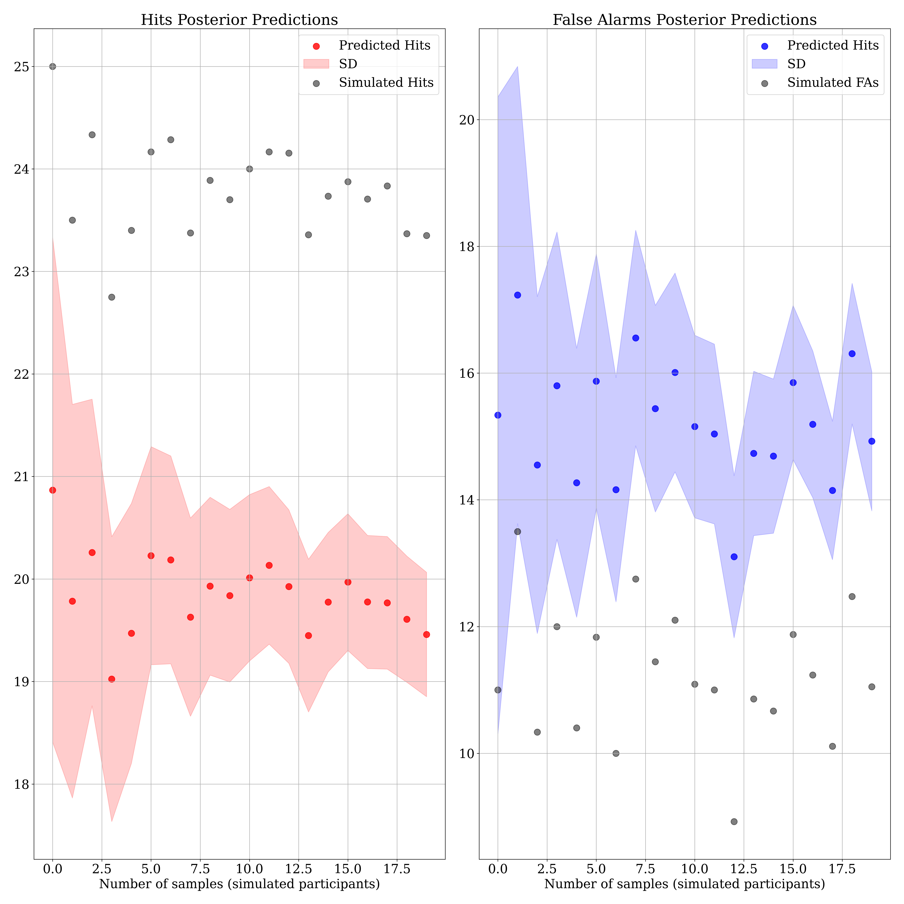

 Predictions from the posterior for the LA group are better, especially for FAs. 

	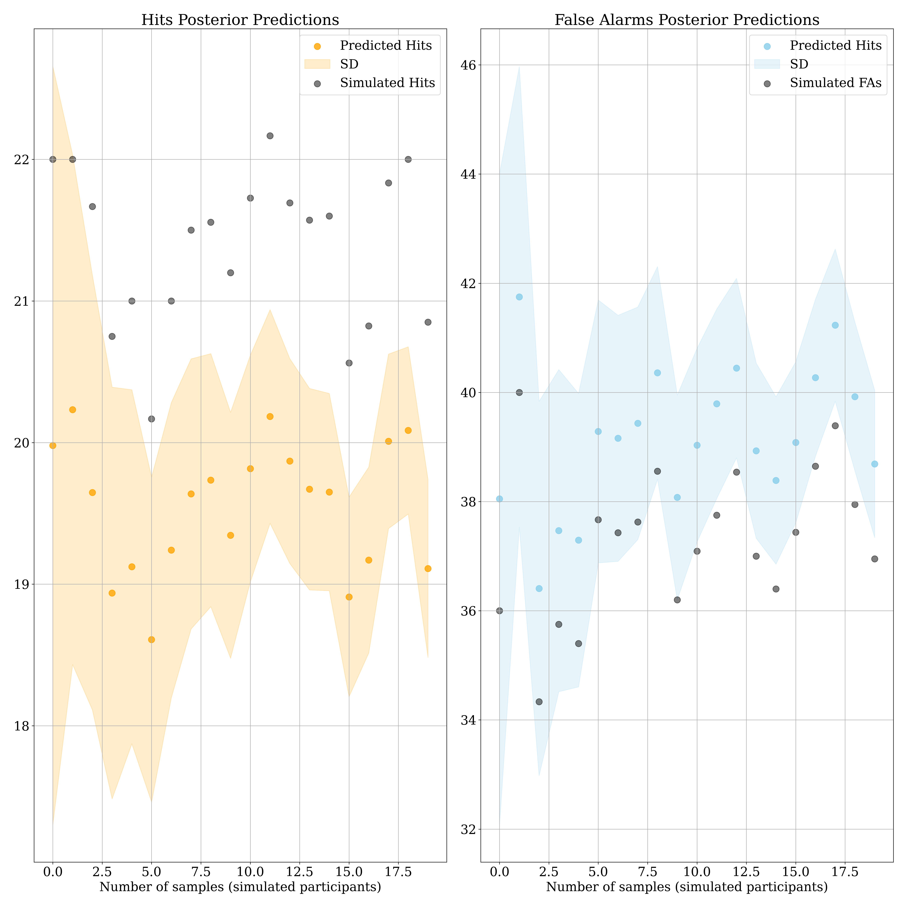

<h1> Conclusion </h1>

 Although the model underperforms in terms of prediction, analyses indicate that reasonably good power is achieved at 20 participants. The present model can use some improvement, such as adaptive priors (i.e. changing to a multilevel model) and better specification of priors via prior predictive checks. In other words, a Bayesian workflow is required before reaching the final version of the model. 

<h1> Model 2 (multilevel) </h1>

 The model used for power analysis corresponds to a signal detection theory (SDT) multilevel model with a non-centred parametrisation for d (sensitivity) and c (bias) varying parameters. 

 dl ~ Normal(0, 1) 

 dz; g,p ~ Normal(0, 1) 

 ds ~ HalfNormal(1) 

 dg,p = dl + dzds 

 cl ~ Normal(0, 1) 

 cz; g,p ~ Normal(0, 1) 

 cs ~ HalfNormal(1) 

 cg,p = cl + czcs 

 erf(z) = (2&div;&Sqrt;&pi;)&int;0zexp(-t2) dt, t = 0...z 

 cdf(x) = 0.5(1 + erf(x/&Sqrt;2)) 

 hg,p = cdf(d/2 - c) 

 fg,p = cdf(-d/2 - c) 

 yh ~ Binomial(hg,p , s) 

 yf ~ Binomial(fg,p , n) 

 Where, g = groups (1...G, G=2), p = participants (1... P, P equals number of simulated participants per run),  s = misses + hits, and n = correct rejections (CR) + false alarms (FA). Observations for yh are total hits and observations for yf are total FAs; erf corresponds to the error function, and cdf corresponds to the cumulative density function of a standard Gaussian. Observations are simulated responses from participant, 1 participant added per run up to 100 runs. Simulations are from two groups, one high accuracy (HA) and one low accuracy (LA). HA misses are rounded random draws from a Binomial(25, 0.05) and HA hits are 25 - misses; HA FAs are rounded random draws from a Binomial(75, 0.15) and HA hits are 75 - FAs. LA misses are rounded random draws from a Binomial(25, 0.15) and LA hits are 25 - misses; LA FAs are rounded random draws from a Binomial(75, 0.5) and LA hits are 75 - FAs. Where maximum Hits are 25 and maximum CRs are 75, from 100 total stimuli within an oddball task.

 We sampled the model using Markov chain Monte Carlo (MCMC) No U-turn sampling (NUTS) with 1000 tuning steps, 1000 samples, 4 chains. Models sampled without divergences and good effective samples, but for even better performance we re-run the final run (50 participants) with 2000 tuning steps and 2000 samples (see power_multi/summary.csv). 

<h1> Results </h1>

 Results from the HA group show that precision decreases exponentially when participants increase for both sensitivity (d') and bias (c), achieving good certainty after 50 participants. 

	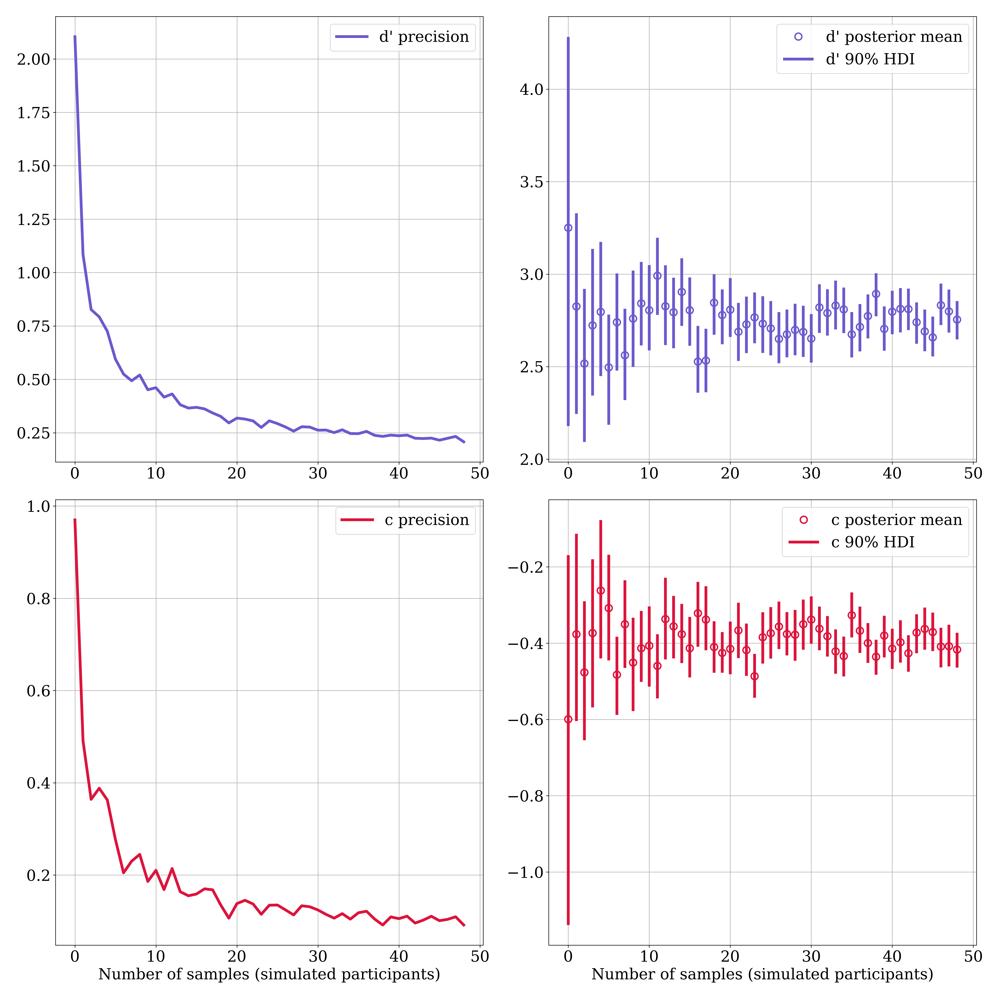

 Results from the LA group show that precision decreases exponentially when participants increase for both sensitivity (d') and bias (c), achieving reasonably good certainty after 40 participants. 

	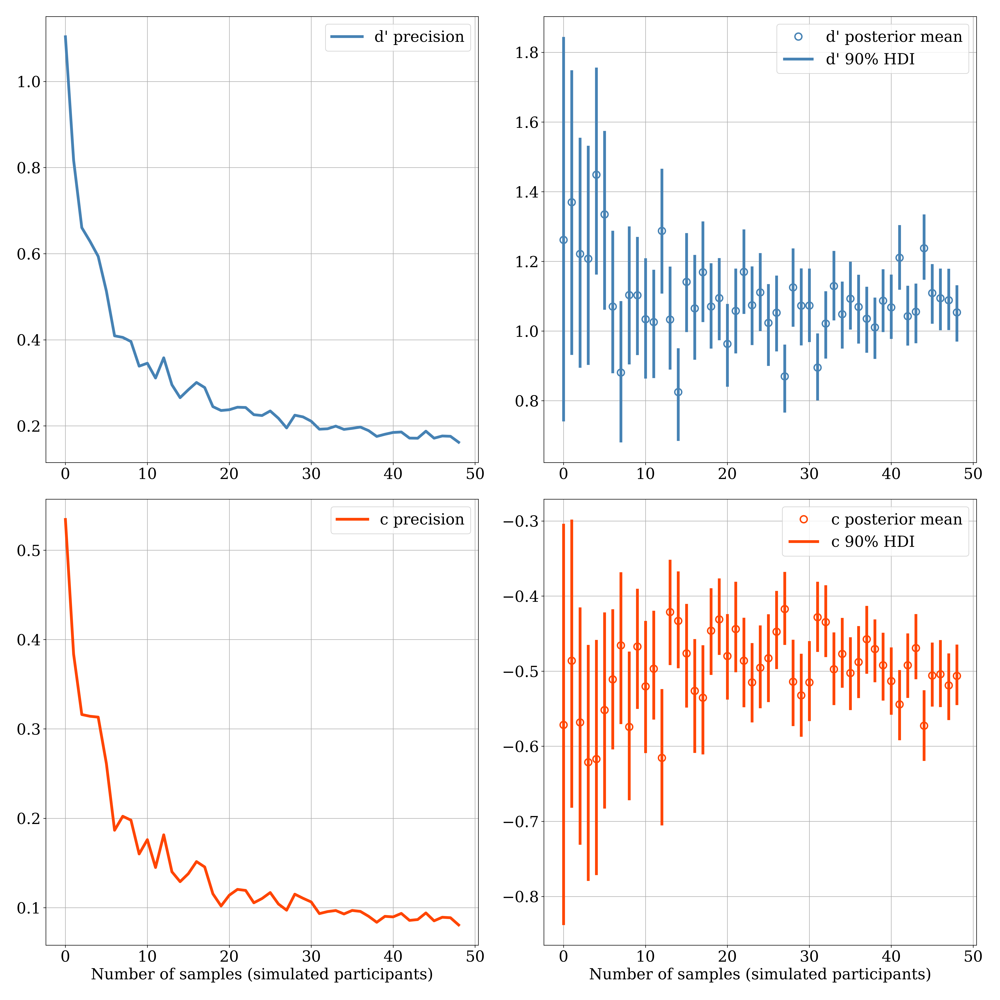

 Predictions from the posterior for the HA group are better respect to Model 1, especially for Hits. 

	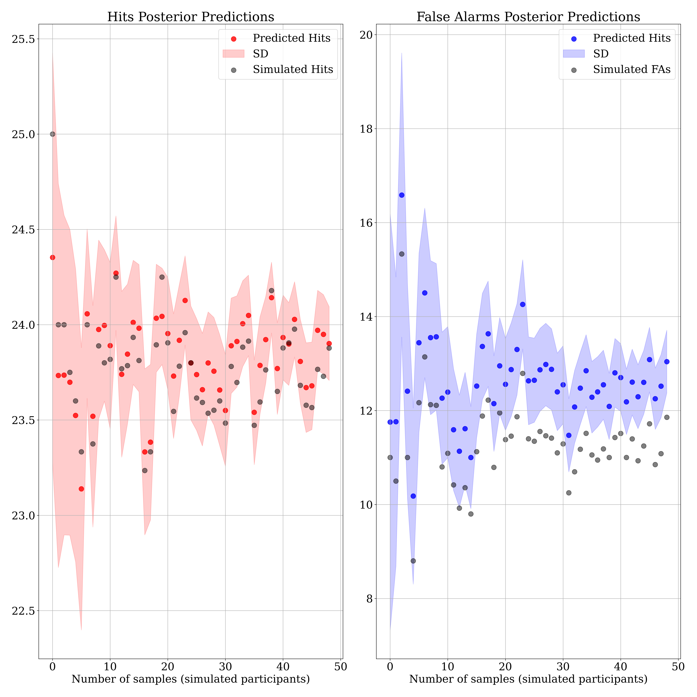

 Predictions from the posterior for the LA group are also better, and also particularly good for Hits. 

	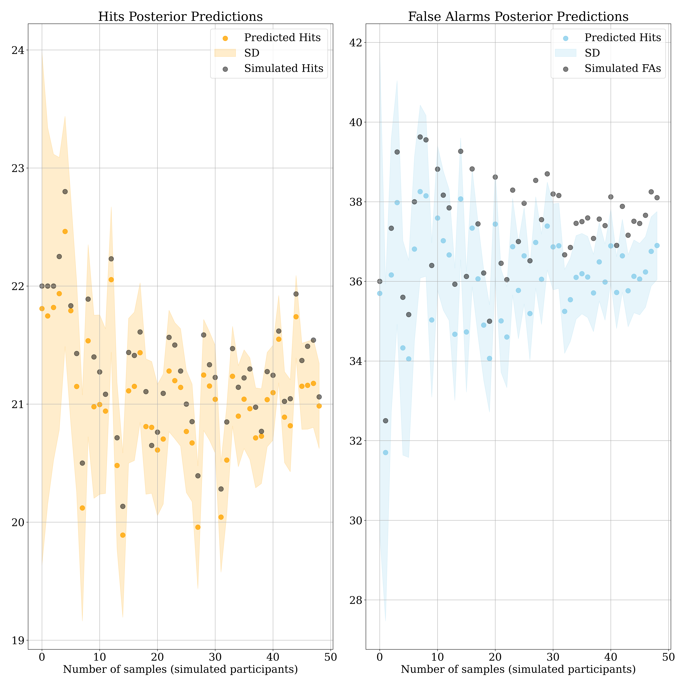

<h1> Conclusion </h1>

 As expected, the multilevel version of the model, although harder to sample, provides much better precision at lower sample sizes. Also, this model provides more accurate posterior predictions. 

<h1> Model 3 (multilevel with multivariate priors) </h1>

 The model used for power analysis corresponds to a signal detection theory (SDT) multilevel model with a non-centred parametrisation for d (sensitivity) and c (bias) varying parameters which are assigned a multivariate Gaussian prior with an LKJ covariance matrix over groups. 

 dsd ~ HalfNormal(1) 

 Ld ~ LKJ(n=G, &eta;=2, sd=dsd) 

 &Sigma;d = LdLTd 

 dg,p ~ Normal(0, 1) 

 d = &Sigma;ddTg,p 

 csd ~ HalfNormal(1) 

 Lc ~ LKJ(n=G, &eta;=2, sd=csd) 

 &Sigma;c = LcLTc 

 cg,p ~ Normal(0, 1) 

 c = &Sigma;ccTg,p 

 erf(z) = (2&div;&Sqrt;&pi;)&int;0zexp(-t2) dt, t = 0...z 

 cdf(x) = 0.5(1 + erf(x/&Sqrt;2)) 

 hg,p = cdf(d/2 - c) 

 fg,p = cdf(-d/2 - c) 

 yh ~ Binomial(hg,p , s) 

 yf ~ Binomial(fg,p , n) 

 Where, g = groups (1...G, G=2), p = participants (1... P, P equals number of simulated participants per run),  s = misses + hits, and n = correct rejections (CR) + false alarms (FA). Observations for yh are total hits and observations for yf are total FAs; erf corresponds to the error function, cdf corresponds to the cumulative density function of a standard Gaussian, and LKJ is the Lewandowski-Kurowicka-Joe distribution for correlation and covariances matrix derived from the L (Cholesky) factor decomposition. Observations are simulated responses from participant, 1 participant added per run up to 100 runs. Simulations are from two groups, one high accuracy (HA) and one low accuracy (LA). HA misses are rounded random draws from a Binomial(25, 0.05) and HA hits are 25 - misses; HA FAs are rounded random draws from a Binomial(75, 0.15) and HA hits are 75 - FAs. LA misses are rounded random draws from a Binomial(25, 0.15) and LA hits are 25 - misses; LA FAs are rounded random draws from a Binomial(75, 0.5) and LA hits are 75 - FAs. Where maximum Hits are 25 and maximum CRs are 75, from 100 total stimuli within an oddball task.

 We sampled the model using Markov chain Monte Carlo (MCMC) No U-turn sampling (NUTS) with 1000 tuning steps, 1000 samples, 4 chains. Models sampled without divergences and good effective samples, but for even better performance we re-run the final run (53 participants) with 2000 tuning steps and 2000 samples (see power_lkj/summary.csv). 

<h1> Results </h1>

 Results from the HA group show that precision decreases exponentially when participants increase for both sensitivity (d') and bias (c), achieving good certainty after 50 participants. 

	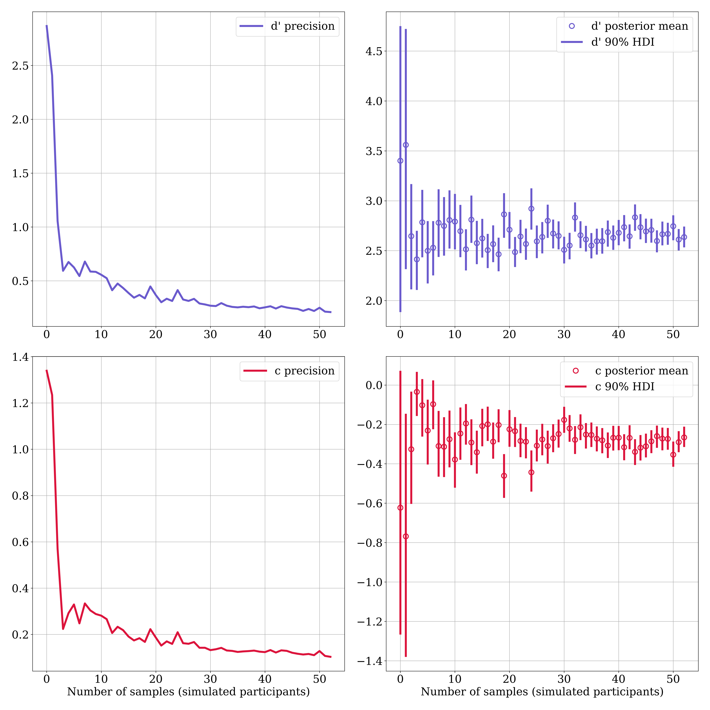

 Results from the LA group show that precision decreases exponentially when participants increase for both sensitivity (d') and bias (c), achieving reasonably good certainty after 40 participants.  Note that these are smoother, probably due to the highet variability in the simulations, thus providing less concentrated and easier to sample estimates. 

	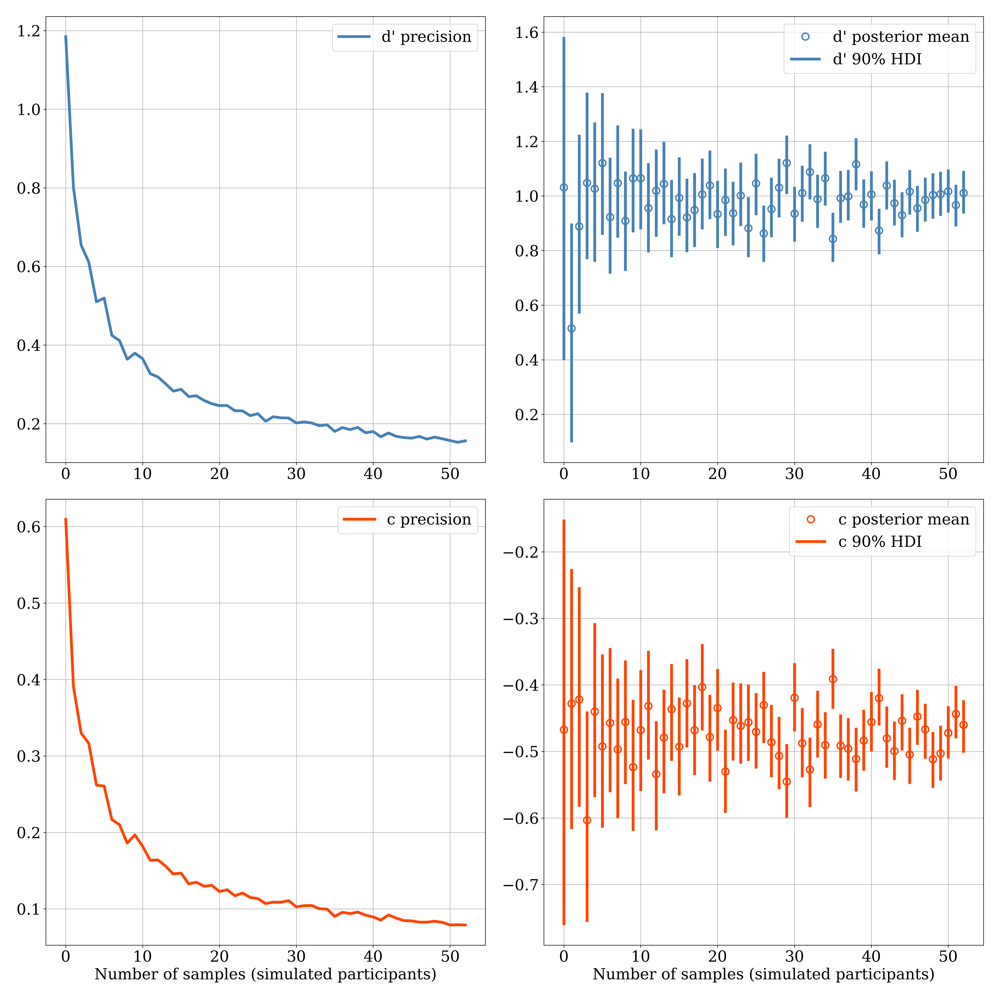

 Predictions from the posterior for the HA group are similar to Model 2, but better for FAs and not much different for Hits. 

	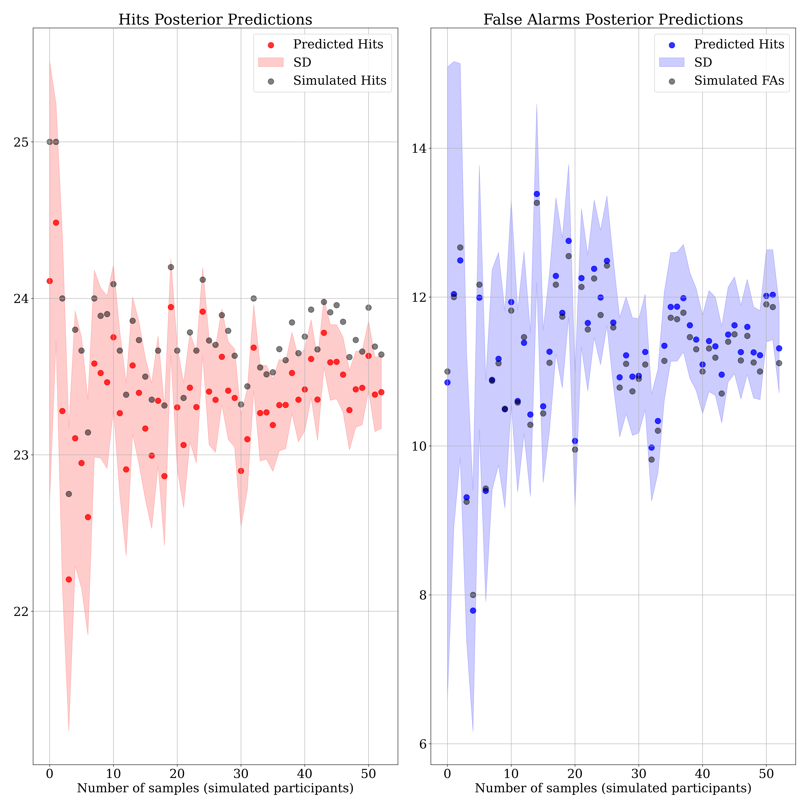

 Predictions from the posterior for the LA group are also better, and also better for FAs and not much different for Hits. 

	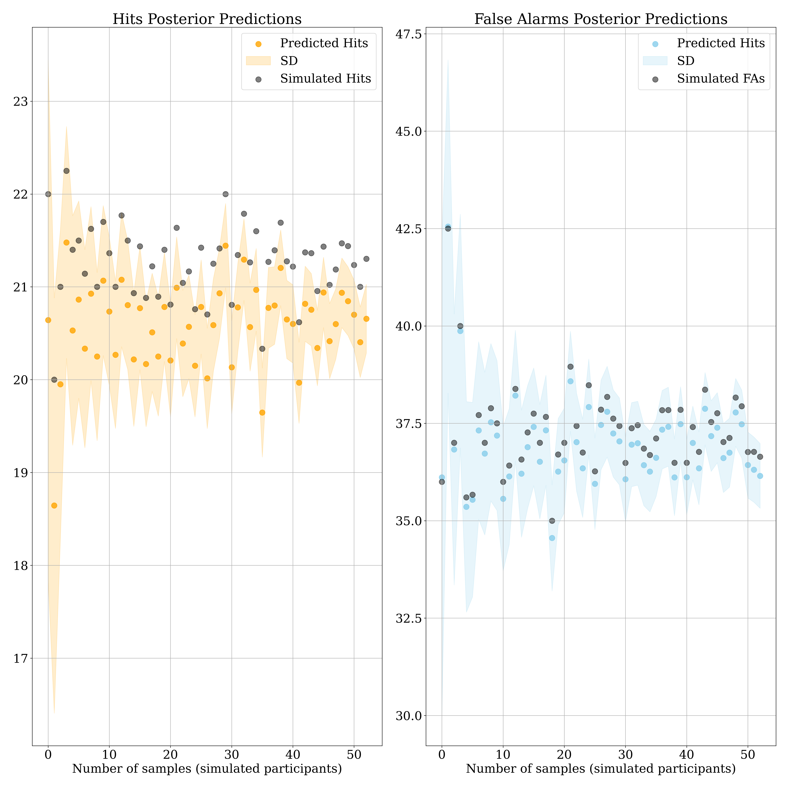

<h1> Conclusion </h1>

 As expected, the multilevel version of the model required a multivariate prior with a prior for covariances, so correlations between groups (hint vs no-hint) could be captured. This was to be expected because receiving a hint should greatly increase the accuracy of participants. Presently, this was simulated by assigning a very high hit rate and very low FA rate to group1 (hint) participants. While group2 (no-hint) was simulated as having high FA rate and slightly lower hit rate, i.e. they tend to answer to more stimuli in general. Model 3 results shows to be an overall better model, proving richer information on detection accuracy and requiring about the same sample size as Model 2. 

